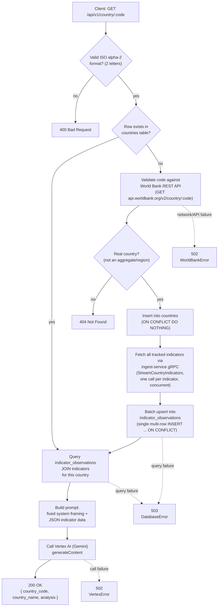

# `backend` v1 request flow

What happens on `GET /api/v1/country/:code`, including the on-demand
ingestion path for a country that isn't tracked yet.

## Notes

- **First-ever request for a new country is slow** (World Bank + gRPC round
  trips); **every request after that** for the same country is a fast
  DB-only path, since the country and its indicator data are now persisted.
- The regular 5-minute ETL schedule takes over keeping already-tracked
  countries fresh — this on-demand path only ever runs once per new
  country, not on every request.
- A per-indicator gRPC fetch failure (e.g. `ingest-service` unreachable)
  degrades gracefully — it's logged and skipped, not fatal to the request.
  The response still returns, just with whatever data was actually fetched
  (possibly none), rather than a 502 for the whole request.
- v2 (not shown here) adds a JSON-schema-validated response shape on top of
  the same flow, with a retry-then-502 step if the model's output doesn't
  validate.
